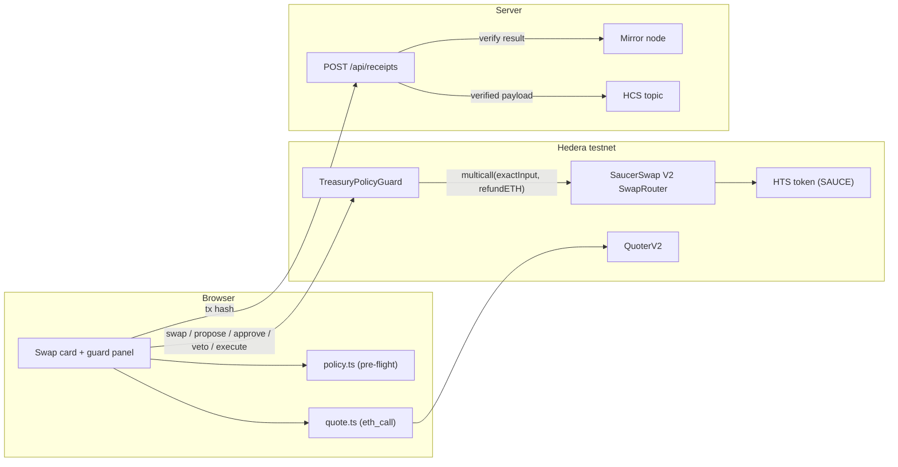
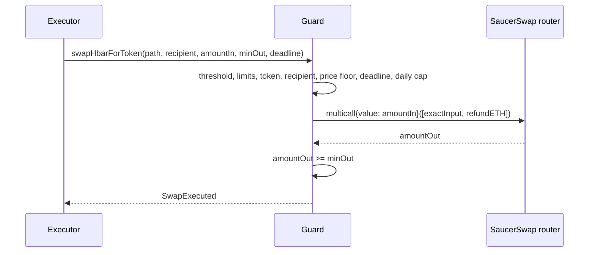
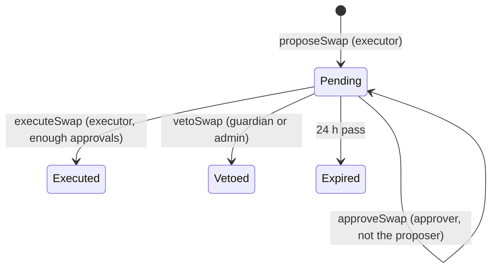

# Architecture

## Pieces

The browser policy gives fast feedback. The contract is the authority.

## Direct lane (small swaps)

## Approval lane (swaps above the threshold)

The proposal stores the amounts and a hash of the path. `executeSwap` takes the path again, checks the hash, re-runs every policy check and then follows the same route as the direct lane.

## Units

| Where | Unit |
| --- | --- |
| Quoter, router `amountIn`, `msg.value`, `address(this).balance` inside the EVM | tinybars (8 decimals) |
| JSON-RPC (Hashio, viem `value`, `useBalance`) | weibars (18 decimals) = tinybars x 10^10 |
| SAUCE | 6 decimals; `minOutPerHbar` is SAUCE units per 1 HBAR |

## Receipts

`POST /api/receipts` never trusts the request body. It rate-limits, deduplicates, fetches the transaction from the mirror node, checks that it called the router or the guard, and writes the mirror-derived fields to HCS.
