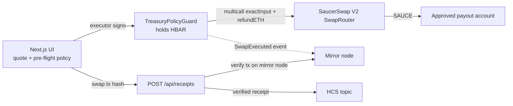

# Treasury Swap Guard

A [scaffold-hbar](https://docs.hedera.com/solutions/tools/scaffold-hbar) template for **DAO and small-team treasuries on Hedera** that convert HBAR into an operating token (grants, payroll, vendor payments) through **SaucerSwap V2**, inside rules a **smart contract enforces**, with an **HCS audit trail**.

Removing SaucerSwap removes the product: the guard contract's only job is to gate treasury HBAR into the V2 `SwapRouter`.

## Who it is for

Treasurers and ops leads of DAOs, grant programs and small teams who share the same few needs:

| Need | How the template covers it |
| --- | --- |
| Cap what one swap can move, and what a day can move | `minAmountIn`, `maxAmountIn`, `dailyCap` in `TreasuryPolicyGuard` |
| Only convert into approved tokens | per-token allowlist, with a **price floor** (minimum output per HBAR) |
| Tokens may only land on approved accounts | payout-recipient allowlist |
| The person who swaps is not the person who sets the rules | `EXECUTOR_ROLE` swaps, `DEFAULT_ADMIN_ROLE` configures, `GUARDIAN_ROLE` can only pause and veto |
| Large swaps need a second person | approval lane: an executor proposes, an `APPROVER_ROLE` account (never the proposer) signs, a guardian can veto |
| Stop everything fast | `pause()` by a guardian, `unpause()` only by the admin |
| Prove what happened | `SwapExecuted` events plus optional HCS receipts verified against the mirror node |

It is deliberately **not** an AI-agent framework, a merchant checkout or a general DEX UI.

## How it works



Two layers use the same rules:

1. **Browser pre-flight** (`utils/saucerswap/policy.ts`): pure TypeScript, fast feedback, and the whole app in "UI mode" with no contract.
2. **Contract authority** (`TreasuryPolicyGuard.sol`): the layer that actually holds the funds. Anything the UI allows but the contract rejects simply reverts; the UI dry-runs the call first and names the failed rule.

## One-command scaffold

```bash
npm create scaffold-hbar@latest my-treasury -- --template hallzyx/hedera-swapy
cd my-treasury
yarn install
yarn next:dev
```

Open [http://localhost:3000](http://localhost:3000).

## Prerequisites

- Node.js >= 20.18.3
- Yarn (Corepack: `corepack enable && corepack prepare yarn@stable --activate`)
- A Hedera **testnet** account with HBAR from the [Hedera Portal faucet](https://portal.hedera.com/faucet)
- MetaMask (or another RainbowKit wallet) on **Hedera Testnet** (chain id `296`)

## Mode 1: UI only (no deploy)

```bash
yarn next:dev
```

Connect a wallet, enter 0.1 to 50 HBAR, confirm the QuoterV2 quote, associate SAUCE if prompted and swap. The browser policy gates the button.

## Mode 2: on-chain treasury guard

```bash
# 1. Create or import a deployer account (encrypted key stored in packages/hardhat/.env)
yarn hardhat:account:generate

# 2. Deploy the guard on Hedera testnet and apply the starter policy
yarn hardhat:deploy --network hederaTestnet --tags TreasuryPolicyGuard
```

The deploy script prints the contract address and a HashScan link. Then:

1. Send testnet HBAR to the guard address (it is the treasury).
2. Associate the payout account with SAUCE (`Associate SAUCE` button, wallet = payout account).
3. Put the address in `packages/nextjs/.env.local`: `NEXT_PUBLIC_TREASURY_GUARD_ADDRESS=0x...`
4. Restart `yarn next:dev`. The **Treasury guard** panel shows the contract's live policy and swaps through it.

Starter policy applied by the script (change it with the admin account at any time):

| Rule | Value |
| --- | --- |
| Per swap | 0.1 to 50 HBAR |
| Per UTC day | 100 HBAR |
| Output token | SAUCE, price floor `TREASURY_MIN_SAUCE_PER_HBAR` (default 30 SAUCE per HBAR) |
| Recipient | `TREASURY_PAYOUT_ADDRESS` (default: deployer) |
| Path | single hop WHBAR -> allowed token |
| Deadline | at most 1 hour ahead |
| Approval lane | off unless `TREASURY_APPROVER` is set; then swaps above `TREASURY_APPROVAL_THRESHOLD_HBAR` (default 10) need 1 approver, proposals expire after 24 h |

To split roles, set `TREASURY_ADMIN` (for example a multisig) and `TREASURY_EXECUTOR` before deploying. When the admin is not the deployer the script only deploys and prints the three admin calls to make.

### Contract tests

```bash
yarn hardhat:test:guard   # in-memory chain, no network needed
```

The suite uses a mock router and covers role checks, amount and daily limits (including the UTC-day reset), token and recipient allowlists, path validation, the price floor, deadlines, pause behaviour, failed-router rollback and admin withdrawals.

## Architecture

See [ARCHITECTURE.md](ARCHITECTURE.md) for the flows and [SECURITY.md](SECURITY.md) for what each role can and cannot do.

| Piece | Role |
| --- | --- |
| `packages/hardhat/contracts/TreasuryPolicyGuard.sol` | Treasury + on-chain policy + SaucerSwap call |
| `packages/hardhat/contracts/interfaces/ISaucerSwapRouter.sol` | Minimal router interface |
| `packages/hardhat/contracts/mocks/MockSaucerSwapRouter.sol` | Test-only router |
| `packages/hardhat/deploy/03_deploy_treasury_policy_guard.ts` | Deploy + starter policy |
| `packages/nextjs/utils/saucerswap/quote.ts` | `eth_call` to QuoterV2 `quoteExactInput` |
| `packages/nextjs/utils/saucerswap/policy.ts` | Pure browser policy |
| `packages/nextjs/utils/saucerswap/association.ts` | Mirror-node association check + HTS associate calldata |
| `packages/nextjs/utils/saucerswap/swap.ts` | Encode `exactInput` + `refundETH` multicall (UI mode) |
| `packages/nextjs/utils/saucerswap/guardAbi.ts` | Guard ABI + readable revert reasons |
| `packages/nextjs/utils/saucerswap/receipt.ts` | Pure mirror-result verification for receipts |
| `packages/nextjs/components/saucerswap/SwapCard.tsx` | UI mode swap card |
| `packages/nextjs/components/saucerswap/TreasuryGuardCard.tsx` | Guard panel: live policy + guarded swap or proposal |
| `packages/nextjs/components/saucerswap/GuardProposals.tsx` | Approve, execute and veto proposals |
| `packages/nextjs/app/api/receipts/route.ts` | Verified, rate-limited HCS receipt writer |

### Testnet addresses (official SaucerSwap deployments)

| Contract / token | Hedera ID | Notes |
| --- | --- | --- |
| QuoterV2 | `0.0.1390002` | Gas-free quotes |
| SwapRouter V2 | `0.0.1414040` | `exactInput` / `multicall` |
| WHBAR | `0.0.15058` | Path uses WHBAR, not native HBAR |
| SAUCE | `0.0.1183558` | Output token (6 decimals) |
| HTS precompile | `0.0.359` / `0x...0167` | `associateToken` |

Pool fee **3000** (0.30%) is the tier that quotes successfully for WHBAR/SAUCE on testnet.

### Decimals gotchas

- Quoter and `exactInput.amountIn`: **tinybars** (8 decimals).
- **Inside the Hedera EVM** (`msg.value`, `address(this).balance`) HBAR is also in tinybars, so the guard forwards `amountIn` as `msg.value` unchanged.
- JSON-RPC (Hashio, viem) accepts and reports **18-decimal weibars** (`tinybars x 10^10`); the UI converts at the edge.
- The price floor is expressed in token smallest units per 1 HBAR (1e8 tinybars).

### Why RainbowKit / wagmi (not HashPack HIP-820)

scaffold-hbar ships RainbowKit + burner for EVM JSON-RPC contract calls. SaucerSwap V2 and the guard are Solidity contracts, so `writeContract` / `sendTransaction` is the native path.

## Environment

Copy the `.env.example` files; never commit secrets.

| Variable | Where | Purpose |
| --- | --- | --- |
| `NEXT_PUBLIC_TREASURY_GUARD_ADDRESS` | `packages/nextjs/.env.local` | Enables the guard panel and receipt target |
| `NEXT_PUBLIC_HEDERA_TESTNET_RPC_URL` | `packages/nextjs/.env.local` | Optional Hashio override |
| `NEXT_PUBLIC_WALLET_CONNECT_PROJECT_ID` | `packages/nextjs/.env.local` | RainbowKit WalletConnect |
| `HCS_OPERATOR_ID` / `HCS_OPERATOR_KEY` | server env | Optional HCS receipt writer (pays the fees) |
| `HCS_TOPIC_ID` | server env | Optional receipt topic |
| `TREASURY_ADMIN`, `TREASURY_EXECUTOR`, `TREASURY_GUARDIAN`, `TREASURY_APPROVER`, `TREASURY_APPROVAL_THRESHOLD_HBAR`, `TREASURY_PAYOUT_ADDRESS`, `TREASURY_MIN_SAUCE_PER_HBAR` | shell, at deploy | Starter policy for `yarn hardhat:deploy` |
| `SWAP_PRIVATE_KEY` | shell only | Headless `yarn demo:swap` (UI-mode swap, no guard) |

## HCS audit trail (optional)

If `HCS_OPERATOR_ID`, `HCS_OPERATOR_KEY` and `HCS_TOPIC_ID` are set, the UI posts the swap hash **after the transaction confirms**. `POST /api/receipts` then:

1. rejects malformed hashes and more than 10 requests per minute per client,
2. looks the transaction up on the mirror node and requires `SUCCESS` and a call to the SaucerSwap router or the guard,
3. writes the **verified** sender, target and amount to the topic (request-body fields are never trusted) and refuses duplicates.

The rate limiter and duplicate set live in process memory; use a shared store if you run many serverless instances.

## Adapting it to your treasury

- **Another output token:** call `setTokenRule(token, true, minOutPerHbar)`, make sure the payout account is associated with it, and re-probe QuoterV2 for the pool fee before relying on a path.
- **Different limits:** `setLimits({minAmountIn, maxAmountIn, dailyCap})` from the admin account.
- **More payout accounts:** `setRecipient(account, true)`.
- **Governance:** make `DEFAULT_ADMIN_ROLE` a multisig; keep `EXECUTOR_ROLE` on the treasurer's hot account.

## Trust model and limits

- Testnet template, not audited. Do not put mainnet funds in it without a review.
- The admin can change every rule and `withdraw` the treasury: the guard limits the **executor**, not the admin.
- Swaps are single-hop WHBAR -> token, exact-input, funded from the treasury balance.
- The price floor is a static rate you set; it is not an oracle.

## Quality commands

```bash
yarn lint
yarn next:check-types
yarn next:test
yarn hardhat:test:guard
yarn next:build
yarn e2e:policy   # Playwright UI checks (no MetaMask)
```

## Testnet evidence

UI-mode swap (MetaMask, Hedera testnet). Full table: [TESTNET_EVIDENCE.md](./TESTNET_EVIDENCE.md).

- Transaction: https://hashscan.io/testnet/transaction/0.0.7314364-1790696429-805962774
- Account: `0.0.10778819` (`0x6F21C2155bF93b49348a422A604310F8CCd6ec74`)
- Result: 1 HBAR -> 40.916451 SAUCE

## Licence

MIT, see [LICENCE](./LICENCE).

## Bounty notes

- Eligibility: `template.json`, `README.md`, `AGENTS.md`, install/lint/build, Hedera services in play (HTS association, smart contracts, optional HCS), no committed `.env`
- Ecosystem integration: SaucerSwap V2 is load-bearing (the guard exists to route treasury HBAR into it)
- Hedera depth: Solidity guard + HTS association + SaucerSwap router + HCS verified receipts
